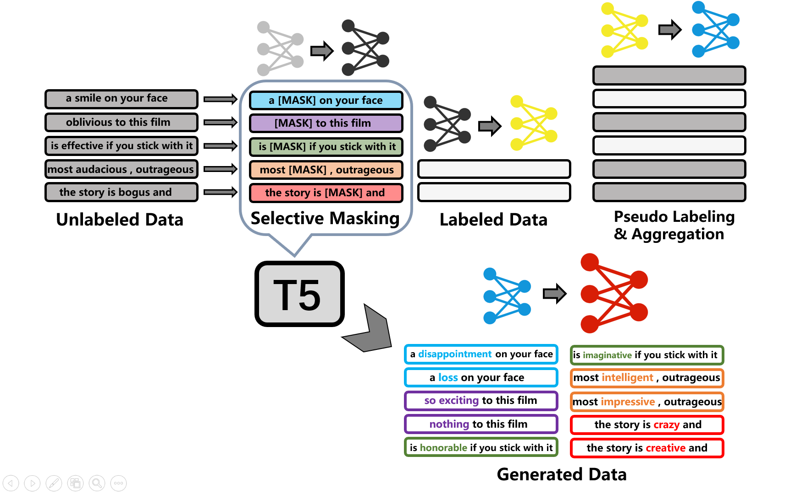
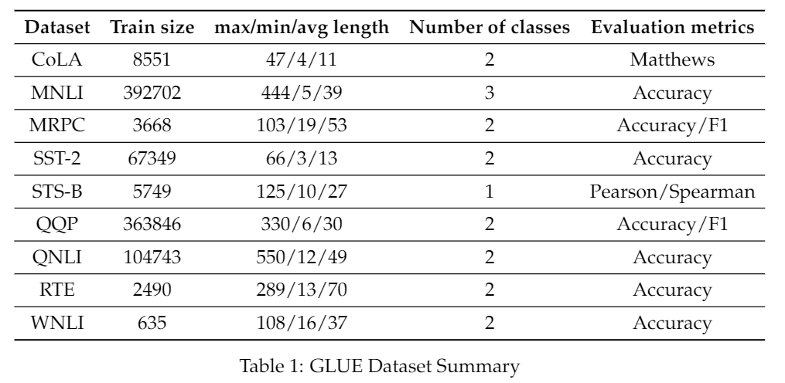
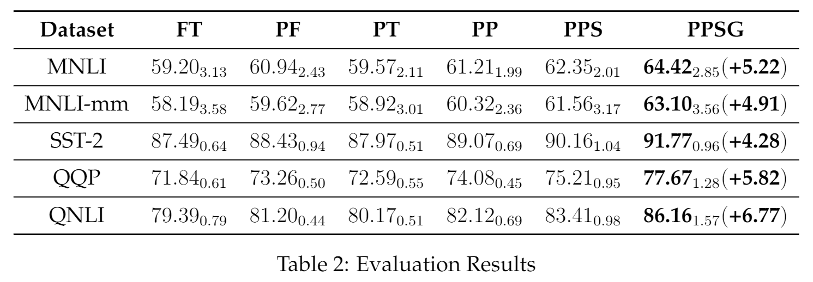
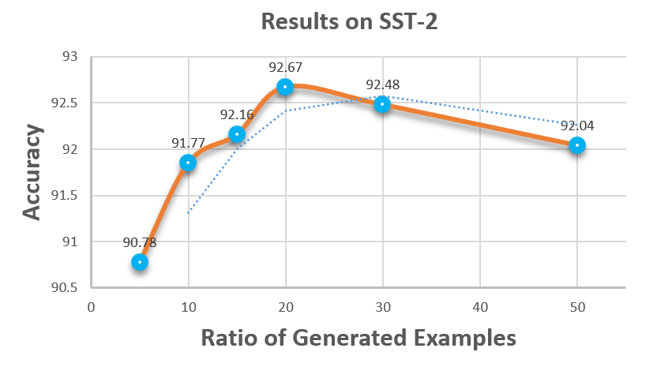

## About this repository  
This repository contains my research work in collaboration with [Zhao Xin](http://ai.ruc.edu.cn/academicfaculty/teachers/20191112003.html)'s team at Renmin University of China from October to December 2021. Our code is based on https://github.com/timoschick/pet.


## Abstract
Most of the current pre-trained models follow the pre-training-fine-tuning paradigm. However, since the task-agnostic nature of the pre-training stage, the fine-tuning stage usually suffers from performance degradation due to insufficient supervised data. In this research project, we propose **a noval paradigm of complementary task-oriented pre-training and generalization training named PPSG**. Specifically, we introduce the prompt training method. Experimental results on five language understanding tasks show that our method significantly improves model performance.

## Pipeline of PPSG 
<div align="center"></div> 

The overall pipeline of PPSG. It has four stages (1) MLM on unlabeled corpus with selective masking (2) PT on labeled data with (1) as initialization (3) Self-training on labeled and unlabeled corpus (4) Use T5 to fill in the masked unlabeled corpus in (1) and continue self-training on the generated corpus until convergence or maximum rounds are reached.


## Getting Started
### Environment

Use `pip install -r requirements.txt` to install pytorch and other additional dependencies. Specially, we use `torch==1.6.0, transformers==4.16.2`, and we don't recommend you to use a higher or lower version of them because it may bring some unnecessary incompatibilities.

### Dataset
We use [GLUE](https://gluebenchmark.com/) benchmark for model training and evaluation, which consists of nine sentence or sentence-pair language understanding tasks. Follow the [official tutorial](https://gist.github.com/W4ngatang/60c2bdb54d156a41194446737ce03e2e) to download and process the GLUE dataset to `'./data'` in your project directory. Here is the summary of GLUE dataset.

<div align="center"></div> 

### Training & Evaluation
```
$ bash run.sh <method> <model_name_or_path> <task> <train_examples> <pattern_id>
```
`method`: The training method to use: MLM: masked language modeling, FT: fine-tuning, PT: prompt-tuning.

`model_name_or_path`: Path to the pre-trained model or shortcut name.

`task`: The name of the task to train/evaluate on.

`train_examples`: < 1 means the ratio to total training examples, > 1 means the number of training examples.

`pattern_id`: The id of the prompt templates.

`device`: The id of the GPUs.

For example, if you want to use bert-base and gpu-0 to run the baseline on sst-2 with 1% labeled data:
```
$ bash run.sh FT bert-base-uncased sst-2 0.01 0 0
```

Note: Since pattern_id is not used during fine-tuning, you can pass in any integer.

If you want to MLM on unlabeled data first, then FT on labeled data, you should use the following commands:
```
$ bash run.sh MLM bert-base-uncased sst-2 0.99 0 0
$ bash run.sh FT <model_saved_path> sst-2 0.01 0 0
```
The `<model_saved_path>` is `./output/<task>/<model_name_or_path>/<local_time>`, check [fire.py](./fire.py) for details.


## Results
<div align="center"></div> 

We use **BERT-base** as our backbone. For each dataset, we randomly sample 1% training data as labeled corpus and left 99% as unlabeled data. In addition, We randomly choose three data splits and have three different runs for each of them to combat the instability by leveraging their results on development sets. As the table shows, PPSG consistently outperform finetuned baseline results across five different datasets, demonstrating its effectiveness on NLU tasks. Detailed results are summarized in Table 2.

## Ablation study
<table align="center">
<thead>
<tr>
<th align="center"></th>
<th align="center">MNLI</th>
<th align="center">MNLI-mm</th>
<th align="center">SST-2</th>
<th align="center">QQP</th>
<th align="center">QNLI</th>
</tr>
</thead>
<tbody>
 <tr>
<td align="center">FT</td>
<td align="center">59.20</td>
<td align="center">58.19</td>
<td align="center">87.49</td>
<td align="center">71.84</td>
<td align="center">79.39</td>
</tr>
<tr>
<td align="center">FT+Random Mask</td>
<td align="center">59.81</td>
<td align="center">58.77</td>
<td align="center">87.94</td>
<td align="center">72.15</td>
<td align="center">79.98</td>
</tr>
<tr>
<td align="center">FT+Selective Mask</td>
<td align="center">60.94</td>
<td align="center">59.62</td>
<td align="center">88.43</td>
<td align="center">73.26</td>
<td align="center">81.20</td>
</tr>
</tbody>
</table>

<div align="center"></div> 

---

Conclusion: *DeepLearning takes time and patience.*

---
